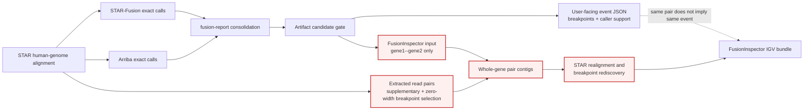
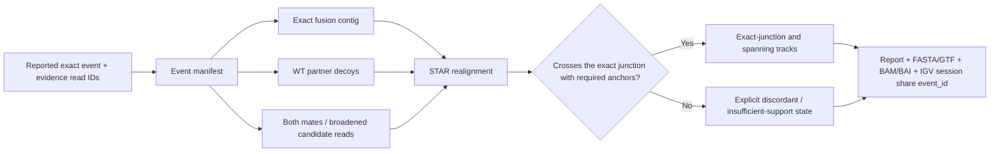

# Synthetic fusion-contig realignment for IGV

## Research question and scope

How do published fusion workflows create a **linear gene-pair or fusion-event reference**, realign RNA-seq reads to it, and expose the resulting alignment in IGV? The goal here is not a whole-genome two-locus view, circos plot, sashimi plot, or fusion cartoon. It is an IGV locus in which reads are aligned to a synthetic contig and the displayed junction is the same event reported to the user.

This review prioritizes original papers, official documentation, and source code. It separates sourced behavior from recommendations for Gennext.

## Executive answer

Other works use three distinct patterns:

1. **Gene-pair rediscovery.** FusionInspector constructs a collinear contig containing both partner genes, realigns reads, and detects a breakpoint again. The submitted item is a gene pair, not an immutable breakpoint. This is useful for independent reinspection, but it does not guarantee agreement with the breakpoint from the first caller.
2. **Exact-event projection.** SeekFusion, EasyFuse, and FUNGI breakpoint mode construct a reference that contains the submitted breakpoint. Reads are realigned to that exact boundary. SeekFusion and FUNGI package the result for IGV; EasyFuse adds the especially useful idea of competing wild-type transcript sequences.
3. **Assembly-contig visualization.** JAFFA assembles candidate fusion transcript contigs, maps reads back to those contigs, and reports the same contig identifier and contig-break coordinate used in IGV.

The key is not merely to “make a gene1+gene2 contig.” The workflow must preserve the exact breakpoint, orientation, transcript context, and any inserted sequence, then make the second alignment the source of the support shown in both the report and IGV. A whole-gene pair contig intentionally allows the second stage to discover a different breakpoint.

## Current Gennext path and the identity-loss point

The affected path in the current somatic RNA workflow is shown below. STAR-Fusion and Arriba produce breakpoint-resolved calls. `fusion-report` then creates both the user-facing event data and a gene-pair list. The post-report artifact gate filters both products, but FusionInspector receives only the gene-pair list. It therefore cannot know which upstream breakpoint, transcript realization, or evidence set it is expected to reproduce.

The workflow wiring is in [somatic-rna-fastq.yaml](../workflows/somatic/v2/somatic-rna-fastq.yaml:293), the visible post-report gate is in [filter-artifact-fusions.yaml](../tasks/base_tasks/filter-artifact-fusions.yaml:75), read selection is implemented in [extract_reads.py](../images/extract-reads-for-fusion-inspector/extract_reads.py:351), and the FusionInspector invocation is in [fusion-inspector.yaml](../tasks/base_tasks/fusion-inspector.yaml:200).

The workflow-side gate immediately before visualization is a partner-name/self-fusion artifact filter; no explicit cohort-frequency calculation is visible there. `fusion-report` receives a fusion-report database and may apply its own internal policy, but that behavior is outside the workflow template. In either case, a candidate gate controls **which** events proceed. It cannot repair the loss of exact event identity between the report and the visualization branch.

## Comparison of direct precedents

| Work | Synthetic reference | Reads realigned | Competition / decoys | Aligner | IGV-ready artifacts | Report-to-view concordance |
|---|---|---|---|---|---|---|
| **FusionInspector** | Full genomic region of gene 1 followed by 1,000 `N`s and full genomic region of gene 2; introns may be shortened | Candidate-supporting reads or all reads, depending on mode | Default validation can combine fusion contigs with the human genome; contigs-only mode removes that competition | STAR for short reads; minimap2 is supported for long reads | Fusion FASTA/FAI, annotations, separate junction/spanning BAMs with indexes, IGV Reports HTML | Strong for **FusionInspector's rediscovered result**; weak for preserving an upstream breakpoint because duplicate gene pairs and breakpoint isoforms are collapsed and redetected |
| **STAR-Fusion + FusionInspector `inspect`** | FusionInspector gene-pair contigs | Only reads STAR-Fusion identified as evidence | Target fusion contigs, rather than a full human-reference competition | STAR | FusionInspector bundle and report | The view is tied to FusionInspector's second-stage result, not guaranteed to preserve STAR-Fusion's original breakpoint |
| **STAR-Fusion + FusionInspector `validate`** | FusionInspector contigs added to the human reference | All input reads | Whole human genome plus fusion contigs | STAR | FusionInspector bundle and report | Strong internal concordance and stronger placement competition; still a breakpoint-redetection workflow |
| **FUNGI FusionVisualizer, breakpoint mode** | Two references: whole partner genes side by side, and genomic partner segments joined at the specified breakpoint | Supplied paired reads | The two synthetic references are aligned separately; no documented wild-type or whole-genome decoy in this step | STAR | Two FASTAs, GTF/GFF annotations, sorted BAMs and BAIs | The exact-reference track is forced to contain the submitted breakpoint, making it a direct visual inspection target; it is not independent confirmation |
| **EasyFuse** | Exact 800-base spliced fusion-transcript context, normally 400 bases per partner, plus two local wild-type transcript contexts | Chimeric, unmapped/improper, sufficiently soft-clipped, and candidate-locus-overlapping reads | Fusion transcript versus wild-type partner contexts | STAR | Requantification SAM and event metrics; no packaged IGV session/reference bundle is documented | Strong event-level requantification because identity includes breakpoint and transcript context, but additional packaging is needed for IGV |
| **SeekFusion** | Exact candidate construct with 150 bases on each side of the breakpoint | Candidate reads after filtering reads that align perfectly to normal transcripts | Normal-transcript filtering before fusion-reference alignment | BWA-MEM | Fusion FASTA, GTF, coordinate-sorted BAM/BAI, VCF, and IGV session | Very strong: the final exact-breakpoint evidence, report/VCF, BAM, and IGV reference are generated from the same construct |
| **JAFFA assembly mode** | De novo assembled candidate fusion transcript contigs | Reads mapped back to candidate fusion sequences | No explicit decoy competition in the read-back stage | Bowtie2 | Candidate fusion FASTA and sorted/indexed BAM; report includes contig and contig-break coordinate | Strong object identity: the report points to the exact assembled contig viewed in IGV; biological breakpoint accuracy remains dependent on assembly and BLAT annotation |
| **CTAT-LR-Fusion** | FusionInspector-style collinear gene-pair contigs with introns capped at 1 kb | Candidate chimeric long reads; matched short reads can also be aligned | Optional combined human-reference competition | minimap2 for long reads, STAR for short reads | Tabular result and interactive IGV report | Strong for the phase-two rediscovered breakpoint; not designed to preserve the phase-one candidate breakpoint |
| **Arriba** | No synthetic linear reference | No synthetic-contig realignment | N/A | Uses the original STAR human-genome alignment | Human-coordinate BAM/SAM inspection and a static fusion PDF | Useful source of exact breakpoints, fusion sequence, and supporting read identifiers, but not a direct solution for a linear fusion locus |

## Sourced findings

### 1. FusionInspector is a gene-pair rediscovery workflow

FusionInspector accepts candidate gene pairs, constructs a mini-reference, aligns reads, and then identifies junction and spanning evidence. Its official input documentation states that STAR-Fusion input is deduplicated by `#FusionName`, and that multiple breakpoints or isoforms for the same partner pair become one candidate whose breakpoints are redetected during alignment ([FusionInspector input formats](https://github.com/FusionInspector/FusionInspector/blob/ee87f638bd1de91282e25de035e322062edd91ec/docs/FUSION_INPUT_FORMATS.md#L30-L46), [breakpoint handling](https://github.com/FusionInspector/FusionInspector/blob/ee87f638bd1de91282e25de035e322062edd91ec/docs/FUSION_INPUT_FORMATS.md#L112-L142)).

The reference-construction source extracts each partner's genomic gene region, optionally shrinks introns, concatenates the left gene, 1,000 `N` bases, and the right gene, and shifts the annotations into the synthetic coordinate system ([contig builder](https://github.com/FusionInspector/FusionInspector/blob/ee87f638bd1de91282e25de035e322062edd91ec/util/fusion_pair_to_mini_genome_join.pl#L194-L256)). Thus, the contig is not a single exact fusion transcript encoded at the original caller's breakpoint. It is a search space in which STAR can discover one or more splice/fusion junctions for that gene pair.

FusionInspector's default validation architecture can align against the human genome plus patched-in fusion contigs, while `--fusion_contigs_only` restricts the search to fusion contigs ([alignment/reference construction](https://github.com/FusionInspector/FusionInspector/blob/ee87f638bd1de91282e25de035e322062edd91ec/FusionInspector#L845-L919)). That distinction matters: adding the human reference lets ordinary or ambiguous reads remain on a better normal locus instead of being forced onto a fusion contig.

For visualization, FusionInspector produces a candidate-contig FASTA and FAI, BED/GTF annotations, indexed junction-read and spanning-read BAMs, cytoband information, and an IGV Reports HTML view ([visualization documentation](https://github.com/FusionInspector/FusionInspector/wiki/FusionInspector-Visualizations), [bundle construction](https://github.com/FusionInspector/FusionInspector/blob/ee87f638bd1de91282e25de035e322062edd91ec/FusionInspector#L810-L843), [evidence BAM extraction](https://github.com/FusionInspector/FusionInspector/blob/ee87f638bd1de91282e25de035e322062edd91ec/FusionInspector#L1106-L1264)). The junction/spanning tracks are extracted from FusionInspector's own final results, which is why its own report and its own IGV bundle agree.

STAR-Fusion exposes two integrations. `--FusionInspector inspect` realigns only STAR-Fusion evidence reads directly to target fusion-gene contigs, whereas `--FusionInspector validate` aligns all original reads to the combined human reference and fusion contigs ([STAR-Fusion wiki](https://github.com/STAR-Fusion/STAR-Fusion/wiki#further-inspection-visualization-and-validation)). Both make the FusionInspector result the second-stage inspection object; neither promises that an independently retained first-stage breakpoint will remain unchanged.

CTAT-LR-Fusion uses the same idea for long reads: an initial genome-alignment phase identifies candidate gene pairs, then candidate chimeric reads are aligned with minimap2 to intron-compressed collinear gene-pair contigs, where breakpoints are detected again. Matched short reads can be aligned with STAR, and the result can be viewed in an interactive IGV report ([CTAT-LR-Fusion paper](https://pmc.ncbi.nlm.nih.gov/articles/PMC10925146/)). This reinforces that the gene-pair contig is a rediscovery reference rather than a projection of an immutable upstream event.

### 2. FUNGI implements both whole-gene and exact-breakpoint views

FUNGI's FusionVisualizer explicitly offers two breakpoint-mode references: `virtual_ref1.fa` places the two genes side by side, while `virtual_ref2.fa` merges the partner segments at supplied breakpoint coordinates. It aligns the reads to both references with STAR and emits FASTA, GTF/GFF, sorted BAM, and BAI artifacts for IGV ([FUNGI documentation](https://bitbucket.org/alejandra_cervera/fungi/src/b821cb7d28c2a4b53ebc3b991b6afe46a9487294/documentation/usage.md), [reference and alignment implementation](https://bitbucket.org/alejandra_cervera/fungi/src/b821cb7d28c2a4b53ebc3b991b6afe46a9487294/scripts/fusion-constructor.pl)). Without breakpoint information, it delegates to FusionInspector. The paper describes the exact-breakpoint mode as a supervised manual-inspection aid and cautions that failure to reconfirm in a supervised realignment does not by itself make the original call false ([FUNGI paper](https://pmc.ncbi.nlm.nih.gov/articles/PMC8504624/)).

The exact-reference implementation uses strand-aware genomic sequence from the retained side of each gene and joins those segments at the specified breakpoint; it carries remapped gene/exon annotations into the synthetic coordinate system. This is especially relevant to Gennext because it directly demonstrates the requested deliverable: a linear, exact-breakpoint reference plus annotations and indexed alignments for IGV.

### 3. EasyFuse uses an exact event plus local normal competitors

EasyFuse gives an event a breakpoint- and transcript-specific identity and constructs an 800-base spliced fusion-transcript context, normally 400 bases from each partner. It also creates two matching wild-type transcript contexts for the partner genes ([sequence construction](https://github.com/TRON-Bioinformatics/EasyFuse/blob/a35885650f3b685a81586d8d5871c84c3595755a/bin/fusionannotation/src/result_handler.py#L82-L141)).

Its read-selection stage retains reads with chimeric alignments, an unmapped mate, improper pairing, at least 10 bases of soft clipping, or overlap with a candidate partner locus ([read selection](https://github.com/TRON-Bioinformatics/EasyFuse/blob/a35885650f3b685a81586d8d5871c84c3595755a/bin/read_selection.py#L1-L146)). EasyFuse then aligns the selected reads with STAR to the fusion and wild-type contexts and computes exact-breakpoint features. A junction read must overlap the breakpoint by at least 10 bases on each side; spanning pairs are counted separately ([requantification workflow](https://github.com/TRON-Bioinformatics/EasyFuse/blob/a35885650f3b685a81586d8d5871c84c3595755a/modules/06_requantification.nf#L49-L155), [EasyFuse paper](https://pmc.ncbi.nlm.nih.gov/articles/PMC7613288/)).

EasyFuse is therefore a strong design precedent for specificity: it asks not just whether a read can map to the fusion, but how fusion support compares with plausible normal transcript contexts. Its documented outputs are event metrics and alignment intermediates rather than a complete IGV bundle.

### 4. SeekFusion ties the exact construct, evidence, report, and IGV session together

SeekFusion creates a candidate fusion reference with 150 bases on each side of the putative breakpoint. It removes reads that align perfectly to known normal transcripts, aligns the retained reads to the custom fusion references using BWA-MEM, and requires supporting reads to span at least 10 bases on both sides of the exact breakpoint. It then uses the fusion-reference BAM to generate a VCF and IGV session ([SeekFusion paper, Methods](https://pmc.ncbi.nlm.nih.gov/articles/PMC8569241/)).

The implementation writes the same fusion-contig identifier and breakpoint coordinate into the FASTA, GTF, and report metadata, sorts and indexes the realignment BAM, and packages an IGV session ([reference/GTF/report construction](https://github.com/jagadhesh89/seekfusion/blob/7732228199727f3d15f496e0a23f2548b9c8ae75/src/NGS_UMIFUSION/main/python/igv_vcf.py#L97-L283), [custom-reference alignment task](https://github.com/jagadhesh89/seekfusion/blob/7732228199727f3d15f496e0a23f2548b9c8ae75/src/NGS_UMIFUSION/main/wdl/tasks/CustomRef.wdl), [evidence filtering and exact-junction BAM](https://github.com/jagadhesh89/seekfusion/blob/7732228199727f3d15f496e0a23f2548b9c8ae75/src/NGS_UMIFUSION/main/wdl/tasks/VCFConvert.wdl)).

This is the clearest direct precedent for deterministic report/view concordance. Its limitation is assay scope: SeekFusion was developed and validated for targeted PCR/UMI RNA sequencing, so its aligner settings and evidence thresholds cannot be transferred to whole-transcriptome RNA-seq without benchmarking.

### 5. JAFFA makes the assembled contig the shared reporting object

In assembly mode, JAFFA assembles transcript contigs, aligns them to the reference transcriptome to identify candidate fusion sequences, maps reads back to those candidate sequences with Bowtie2, and creates a coordinate-sorted indexed BAM ([JAFFA pipeline implementation](https://github.com/Oshlack/JAFFA/blob/71fe024e46315cf09b896989b0a362f377df2f9c/JAFFA_stages.groovy#L357-L413), [JAFFA paper](https://genomebiology.biomedcentral.com/articles/10.1186/s13059-015-0694-1)). Its report includes the exact contig identifier and a `contig break` coordinate. The official IGV instructions tell the user to load the sample's fusion FASTA as the genome, load the sorted BAM, and navigate to that reported contig and coordinate ([JAFFA IGV instructions](https://github.com/Oshlack/JAFFA/wiki/FAQandTroubleshooting#how-to-view-the-read-coverage-over-a-fusion-transcript-in-igv-assembly-only), [output description](https://github.com/Oshlack/JAFFA/wiki/OutputDescription)).

This achieves report/view identity by reporting the same assembled object that is visualized. The tradeoff is that an assembly may be incomplete, multiple contigs can represent one biological event, and selecting a representative contig adds assembly-dependent variability.

### 6. Arriba, FusionCatcher, and DRAGEN are useful contrasts, not direct models

Arriba's output can include exact breakpoint coordinates, transcript IDs, a fusion-transcript sequence with the breakpoint marked, and supporting read identifiers. Its standard IGV workflow, however, loads the original human-coordinate STAR BAM and chimeric SAM and opens the two genomic breakpoints side by side; `draw_fusions.R` produces a static fusion diagram rather than a synthetic-contig alignment ([Arriba visualization guide](https://github.com/suhrig/arriba/blob/02bfd7d359130f653bbdad8563bcf3d03ee4b029/documentation/06-Visualization.md), [output fields](https://github.com/suhrig/arriba/blob/02bfd7d359130f653bbdad8563bcf3d03ee4b029/documentation/05-Output-files.md#fusion_transcript)). Arriba is therefore a good upstream source for an exact-event adapter, not the adapter itself.

FusionCatcher can export supporting reads and optionally realign them with Bowtie2 to a user-selected genome, but its documented visualization path does not build a linear exact-fusion reference ([FusionCatcher manual](https://github.com/ndaniel/fusioncatcher/blob/master/doc/manual.md#63---visualization)). DRAGEN similarly reports breakpoints and supporting read names for extraction from the whole-genome BAM, without documenting a synthetic fusion-contig IGV bundle ([DRAGEN RNA fusion documentation](https://support-docs.illumina.com/SW/dragen_v42/Content/SW/DRAGEN/RNAGenFus.htm)).

## What “concordance” must mean

There are four different kinds of agreement that can otherwise be conflated:

1. **Candidate concordance:** both stages mention the same gene pair.
2. **Breakpoint concordance:** both stages use the same strand-aware genomic boundary, transcript context, and inserted bases.
3. **Evidence concordance:** the same read or fragment identifiers supporting the report are present and visibly support the exact boundary in the BAM.
4. **Artifact concordance:** the report, FASTA, annotation, BAM header, and IGV session all refer to one stable event/contig identifier and coordinate.

FusionInspector guarantees mostly (1) and, for its own second-stage output, (3) and (4). It does not attempt to preserve an upstream breakpoint. SeekFusion's architecture targets all four by regenerating the final exact-breakpoint evidence and visualization artifacts from one construct. JAFFA achieves (3) and (4) by making the assembled contig the canonical object.

An exact synthetic-contig alignment is still **supervised visualization**, not independent validation. Restricting the reference to a candidate fusion makes alignment easier and can attract ambiguous reads. Wild-type or whole-human-reference competition, minimum breakpoint anchors, and explicit failure states reduce this risk, but biological/clinical validation still requires assay-specific benchmarking or an orthogonal method.

## Recommendation for Gennext — inference from the precedents

The following is a design recommendation, not a claim made by any one source.

### Make the report event, not the gene pair, the unit of visualization

Create a stable `event_id` containing or resolving to:

- 5′ and 3′ gene identifiers and display names;
- exact genomic breakpoints, strands, and reference build;
- selected transcript identifiers or an explicit genomic-context event type;
- any non-template/inserted sequence represented at the junction;
- caller and policy/reference versions.

Do not collapse distinct breakpoints or transcript realizations merely because they share a gene pair. FusionInspector does this intentionally because it is rediscovering pair-level events; that behavior conflicts with a requirement that a particular reported breakpoint be shown in IGV.

### Construct an exact event reference with normal competitors

For exon/transcript-resolved events, build a spliced fusion-transcript contig around the exact reported junction. A practical starting context is 250–500 bases per side; the literature demonstrates 150 bases in SeekFusion and 400 bases in EasyFuse. Preserve any inserted bases reported at the junction.

Add two local wild-type transcript contexts, one for each partner, following EasyFuse. For the highest-specificity validation mode, optionally align against the human reference plus fusion contigs, following FusionInspector `validate`. Local wild-type decoys are likely the more scalable default for per-event visualization, but this choice must be benchmarked.

For intronic, intergenic, or transcript-ambiguous events, use a separately labeled genomic-flank construct or emit `no_exact_transcript_view`; do not silently invent an exon combination.

### Reuse the first-stage evidence deliberately

Start with the union of the caller-provided junction and spanning fragment identifiers and include both mates. If caller read identifiers are incomplete, broaden the evidence set using EasyFuse-like rules: chimeric, unmapped/improper, sufficiently soft-clipped, and partner-locus-overlapping reads. Keep the broad “candidate” track separate from the stricter exact-junction track.

STAR is a reasonable short-read aligner for consistency with the existing workflow, and the precedents show that STAR, BWA-MEM, and Bowtie2 can all support this pattern. The deterministic event/reference contract matters more than changing aligners.

### Derive the user-facing support from the exact alignment

Require an exact-junction read to cross the synthetic boundary with a configurable minimum anchor on both sides; 10 bases is a published starting point in EasyFuse and SeekFusion. Count junction reads and spanning fragments separately. The report should show the second-stage exact-junction count used by the BAM, while retaining the first-stage caller count as a separate provenance field rather than pretending the counts are interchangeable.

If no read crosses the exact boundary, publish a visible state such as `visualization_discordant` or `insufficient_exact_support`. Do not switch to a newly rediscovered breakpoint under the same event identifier, and do not silently omit the event.

### Emit one self-consistent IGV bundle

For each sample or batch of events, emit:

- `fusion-events.fa` and `fusion-events.fa.fai`;
- `fusion-events.gtf` or BED with partner features and the exact junction;
- coordinate-sorted `fusion-events.bam` and `.bai`;
- a manifest mapping `event_id` to contig name, junction coordinate, input read IDs, and exact-support status;
- an IGV session or IGV Reports HTML;
- optionally separate exact-junction and spanning/candidate BAM tracks, following FusionInspector's visual separation.

IGV requires coordinate-sorted, indexed alignment files and consistent reference sequence names; its documented custom-genome inputs support FASTA plus optional gene annotations ([IGV data-track documentation](https://igv.org/doc/desktop/FileFormats/DataTracks/), [IGV original paper](https://pmc.ncbi.nlm.nih.gov/articles/PMC3603213/)).

### Keep FusionInspector as a separate rediscovery/QC mode

FusionInspector remains useful for asking, “Is there support for some fusion configuration between these genes?” It should not be the canonical exact-event visualization unless the user-facing report is also changed to FusionInspector's rediscovered breakpoint and counts. A clean product distinction would be:

- **Exact event view:** deterministic representation of the event being reported.
- **Pair rediscovery/QC:** FusionInspector view that may find a different breakpoint and is labeled accordingly.

## Minimal validation plan before changing production behavior

Benchmark the exact-event adapter on positive controls, normal/negative samples, paralogous genes, read-throughs, repetitive partners, and events with multiple breakpoints for one gene pair. Measure:

- recovery of caller-reported junction read identifiers;
- exact-boundary anchor distribution and mapping quality;
- loss or reassignment to wild-type decoys;
- agreement between manifest event, BAM contig, GTF junction, and report link;
- behavior for inserted bases and noncanonical splice junctions;
- deterministic failure reporting when a view cannot be produced.

The acceptance invariant should be simple: **every reported event opens to the same `event_id` and exact breakpoint in IGV, and the report's visualization-support counts are computed from the BAM being shown.** This guarantees presentation concordance while leaving the scientific question of independent validation explicit.
